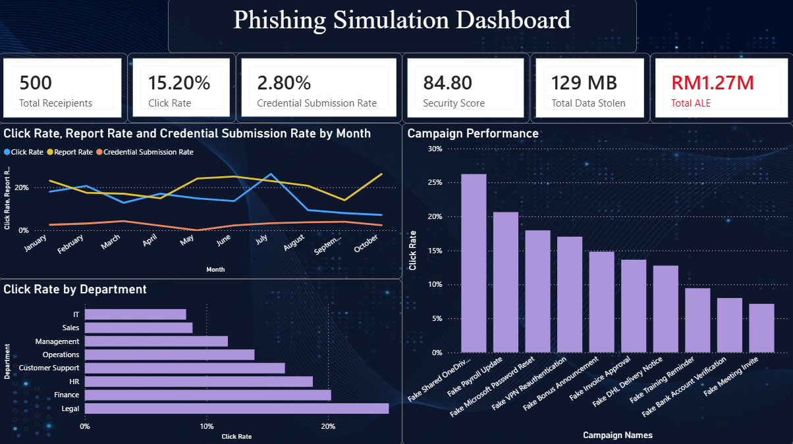
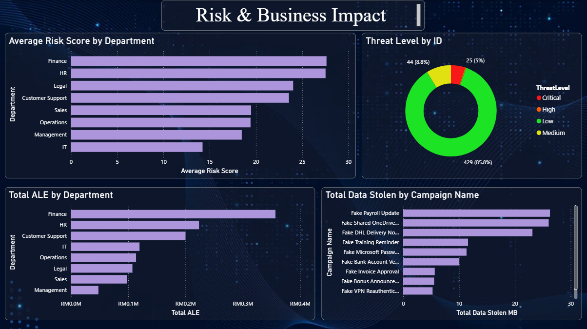

# Phishing Simulation Dashboard

This project is an interactive Cybersecurity Phishing Simulation Dashboard built using Power BI. The dashboard analyzes simulated phishing test results across employees, departments, campaigns, and risk categories to help business users understand phishing exposure, employee behavior, and potential business impact.

The dashboard is designed to support cybersecurity teams and management in identifying high-risk departments, evaluating phishing campaign performance, monitoring security awareness indicators, and estimating potential financial exposure through Annualized Loss Expectancy (ALE).

## Project Objective

The objective of this project is to demonstrate how phishing simulation data can be transformed into a clear and business-friendly dashboard. Instead of only showing technical cybersecurity metrics, this dashboard presents phishing risk in terms of employee behavior, department exposure, severity level, and estimated financial impact.

## 1. Executive Summary

The first page provides a high-level overview of the phishing simulation results. It includes key performance indicators such as:

- Total recipients tested
- Click rate
- Credential submission rate
- Security score
- Total data stolen
- Total Annualized Loss Expectancy (ALE)

This page also includes visual analysis for:

- Monthly phishing trend
- Campaign performance by click rate
- Department risk ranking
- Click rate, report rate, and credential submission rate comparison

The purpose of this page is to give management a quick understanding of overall phishing risk and employee response behavior.

## 2.Risk & Business Impact

The second page focuses on translating phishing simulation results into business risk. It includes:

- Average risk score by department
- Severity distribution
- Total ALE by department
- Total data stolen by campaign

This page helps identify which departments and phishing campaigns contribute the most to organizational risk and potential financial loss.

## Key Insights

From the dashboard analysis:

- Certain departments show higher phishing susceptibility based on click rate and risk score.
- Campaigns such as fake payroll updates and shared document invitations create higher employee engagement and risk.
- Credential submission and data exposure are key indicators of severe phishing impact.
- Annualized Loss Expectancy helps convert cybersecurity risk into financial terms that business stakeholders can understand.
- Department-level risk ranking helps prioritize follow-up actions and awareness efforts.

## Tools Used
- Power BI Desktop
- DAX Measures
- CSV Dataset
- Data Visualization
- Risk Scoring
- Cybersecurity Analytics

## Main Power BI Features Applied
- KPI cards
- Line charts
- Bar charts
- Donut chart
- Interactive slicers
- Percentage-based measures
- Financial risk metrics
- Department-level analysis
- Campaign-level performance analysis

## Example Metrics Created
- Click Rate
- Report Rate
- Credential Submission Rate
- Security Score
- Average Risk Score
- Total Data Stolen
- Total Annualized Loss Expectancy
- Severity Distribution
- Department Risk Ranking

  
